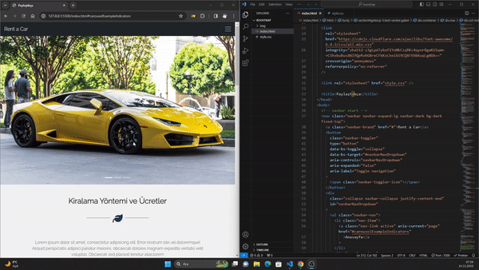

🚀  Rent a Car Web Sitesi 🚀 

Bu proje, bir araç kiralama işi için tasarlanmış basit bir web sitesi şablonudur. Web sitesi, anasayfa, hakkımızda, ekibimiz, galeri ve iletişim gibi bölümleri içerir.

 🌟  Açıklama  🌟 

Bu proje, HTML, CSS ve Bootstrap 5 kullanılarak oluşturulmuş, bir araç kiralama işi için tasarlanmış bir duyarlı web sitesidir. Anasayfa, bir kaydırıcıyla birlikte, hakkımızda, ekip üyeleri, galeri ve iletişim formu gibi bölümleri içerir.

 🌟  Özellikler  🌟 

- Duysal tasarım
- Stil için Bootstrap bileşenleri
- Görüntü kaydırıcısı için Carousel
- Ekip üyesi kartları
- Duyarlı görüntü ızgarasıyla galeri
- İletişim formu

 🌟  Kurulum  🌟 

1. Depoyu klonlayın: `git clone https://github.com/kullanıcı-adınız/proje-reponuz.git`
2. Projeyi kod düzenleyicinizde açın.
3. Web sitesini görüntülemek için tarayıcınızda `index.html` dosyasını açın.

🌐 Katılım 🌐

Bu projeye katkıda bulunmak istiyorsanız, lütfen avcisalihoffical@gmail.com bana ulaşabilirsiniz veya github hesabımı takip edin.

